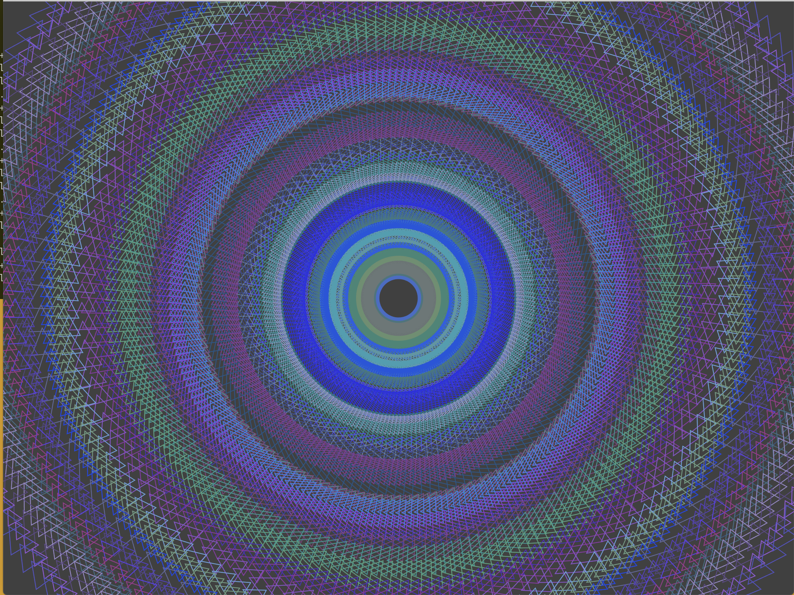
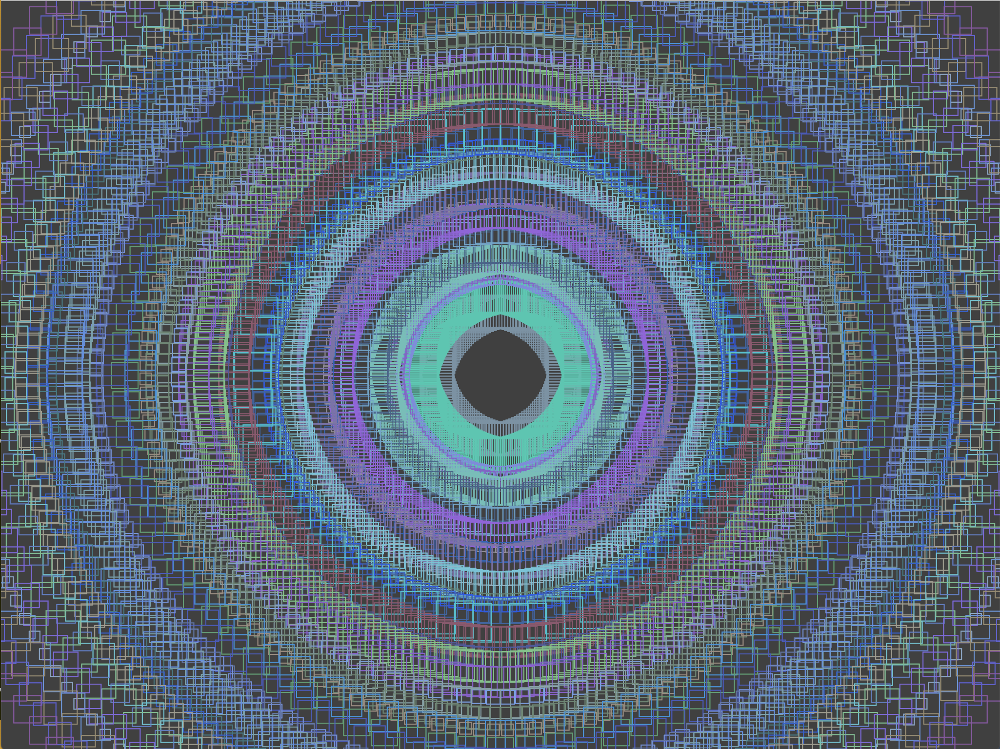

# Color Dancing
This is a small and quick project made to explore the [nannou](https://nannou.cc/) rust library for creative coding. This creates simple swirl patterns on the
render buffer and randomly chooses colors that best compliment each other for each rotation.

## Instructions
Press C to stop the current pattern.

Press Space to restart the patterns when rendering is stopped or completed.

## Screen Shots

